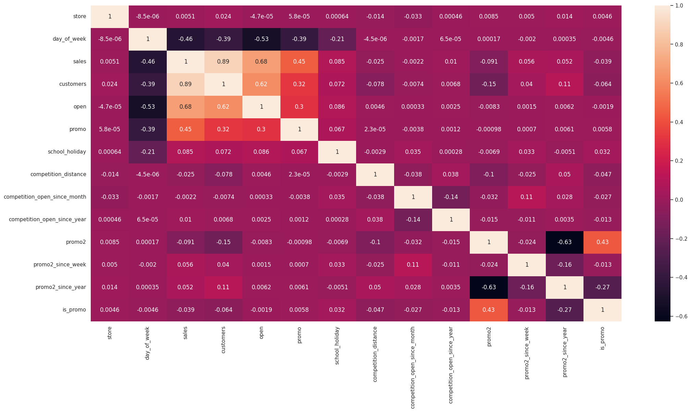

<!-- # Rossman Sales

Esse repositório contém os arquivos criados no curso DS em produção da Comunidade DS.

# Base de Dados

Aqui você pode encontrar os arquivos utilizados nos exercícios do curso:

(Arquivos CSV)[https://www.kaggle.com/competitions/rossmann-store-sales/data] -->

<!--- LANGUAGE --->
<h6 align="center"><a href="/README.md">PORTUGUÊS</a> | <a href="/README_en.md">ENGLISH</a>
</h6>
 

<h1 align="center">
    
</h1>

<h4>

Modelo de previsão de vendas para lojas Rossmann.

</h4>
 

## Problema de Negócio
A Rossmann opera mais de 3.000 drogarias em 7 países europeus. Atualmente, os gerentes de loja da Rossmann têm a tarefa de prever suas vendas diárias com até seis semanas de antecedência. As vendas das lojas são influenciadas por muitos fatores, incluindo promoções, concorrência, feriados escolares e estaduais, sazonalidade e localização. Com milhares de gerentes individuais prevendo vendas com base em suas circunstâncias únicas, a precisão dos resultados pode ser bastante variada.

A Rossmann está desafiando você a prever 6 semanas de vendas diárias para 1.115 lojas localizadas em toda a Alemanha. Previsões de vendas confiáveis ​​permitem que os gerentes de loja criem cronogramas de funcionários eficazes que aumentam a produtividade e a motivação. Ao ajudar a Rossmann a criar um modelo de previsão robusto, você ajudará os gerentes de loja a permanecerem focados no que é mais importante para eles: seus clientes e suas equipes!

## Dados
Os dados utilizados para treinar o modelo foram obtidos do Kaggle, no desafio "Rossmann Store Sales". Os dados incluem informações sobre as vendas, promoções, feriados, condições climáticas e outros fatores que podem influenciar as vendas.

## Solução
A solução proposta consiste em um modelo de machine learning que possa prever as vendas das lojas Rossmann nas próximas seis semanas. Esse modelo está hospedado em nuvem, e pode ser acessado através de bot de Telegram a qualquer momento, assim os stakeholders do projeto tem a previsão de vendas de suas lojas sempre à disposição.

## Análise Exploratória de Dados
A primeira ação para solucionar o problema proposto foi a realização de uma descrição e de uma análise exploratória dos dados, com o objetivo de tratar e entender os dados disponíveis.

Foram conduzidas três tipos de análises:  

### **Análise Univariada**  
Análise da distriuição de cada variável de forma isolada. Nessa fase foi possível observar, por exemplo, que **a variável resposta não possui uma distribuição normal**.

### **Análise Bivariada**  
Cada variável é analisada em relação a *variável resposta*. Nessa fase criamos e validamos uma lista de hióteses que podem trazer *insights* sobre os dados. Algumas descobertas importantes foram:

- Theres **no clear correlation** between competition distance and sales.  
- Theres **no clear correlation** between competitors age and sales.
- There is **no clear growth trend** in sales through the years. But there is a seasonality trend.

### **Análise Multivariada**  
Nessa fase utilizamos a Coeficiente de Pearson para analisar a relaação entre todas as variáveis disponíveis.

## Modelo de Machine Learning
Para escolher o modelo ideal, testa-se vários modelos se modificar parâmetros e compara suas métricas com um modelo simples de média. O resultado foi:  

| **Model**             | **MAE** | **MAPE** | **RMSE** |
|-----------------------|:---------:|:----------:|:----------:|
| **Random Forest**     | 651.34  | 0.0958   | 1023.1   |
| **XGBoost**           | 1130.0  | 0.1671   | 1632.44  |
| **Average Model**     | 1354.8  | 0.2064   | 1835.14  |
| **Lasso**             | 1890.57 | 0.2893   | 2741.42  |
| **Linear Regression** | 2078.71 | 0.3047   | 3102.64  |

> [!NOTE]
> Esses dados mostram que o **modelos lineares não performam melhor que o modelo de média**, o que indica que **esses dados precisam de modelos mais complexos**.

Em seguida análisamos a performance dos modelos utilizando *cross validation*, e os resultados são:

| **Model**             | **MAE CV**         | **MAPE CV**       | **RMSE CV**        |
|-----------------------|:--------------------:|:-------------------:|:--------------------:|
| **Random Forest**     | 733.8 +/- 117.35   | 0.106 +/- 0.0158  | 1102.23 +/- 178.97 |
| **XGBoost**           | 981.66 +/- 103.56  | 0.1409 +/- 0.0108 | 1401.81 +/- 145.51 |
| **Lasso**             | 1947.16 +/- 132.37 | 0.2863 +/- 0.0033 | 2814.28 +/- 214.06 |
| **Linear Regression** | 1927.38 +/- 95.66  | 0.298 +/- 0.0153  | 2724.56 +/- 179.52 |

## Modelo Final
Após os testes, o modelo escolhido para implementação da solução final foi o **XGBoost Regressor** 

> [!NOTE]
> O modelo de **XGBoost Regressor** foi preferido,entre outros de melhor performance, por sua **rápida implementação e menor tamanho de arquivo**. Essas características são importantes quando se deseja colocar o modelo em produção.

Para realizar a tunangem de hiperparâmetros foi utilizado o algoritimo de **Random Search**, o que gerou um modelo com a seguinte performance:

| **Model**             | **MAE** | **MAPE** | **RMSE** |
|-----------------------|:-------:|:--------:|:--------:|
| **XGBoost Regressor** | 729.5   | 0.1066   | 1088.71  |

## Performance
É posssível analisar a performance do modelo final de algumas maneiras diferentes.  
- É possível observar que a maior parte das lojas possui um **erro percentual (MAPE) na faixa de 0% a 20%**, porém o **erro máximo chega próximo a 120%**, o que pode representar um problema.

- É viavel somar o faturamento previsto para todas as lojas, e projetar cenários de faturamento total a partir do erro médio.

|**Scenario**    | **Values**       |
|:--------------:|:----------------:|
| Predictions    | € 282,895,872.00 |
| Worst Scenario | € 249,995,088.00 |
| Best Scenario  | € 315,796,640.00 |

- O gráfico superior direito mostra que o **modelo está subestimando** os valores, caso a superestimação seja melhor para o modelo de negócio o modelo deve ser ajustado.

## Deploy
O modelo final foi disponibilizado por meio de uma API desenvolvida com [FastAPI](https://fastapi.tiangolo.com/) e hospedada no [Render](https://render.com/). O código dessa API está [disponível aqui](https://github.com/eliasbatistasouza/rossmann_api).

Os resultados das predições também podem ser acessados através de um bot do telegram.

O funcionamento do bot pode ser visto abaixo.

https://github.com/eliasbatistasouza/rossmann_sales/assets/8121717/274dff03-ca4b-4332-b2ea-4d4c244e1e51

## Conclusão

## Próximos Passos
- Testar outras features
- Testar outros algoritmos de fine tuning
- 

## Licença
Distribuído sob a licença MIT. Veja `LICENSE.txt` para mais informações.

## Reconhecimentos

## Autor
Feito com ❤️ por Elias Batista 👋🏽 Entre em contato!

 
