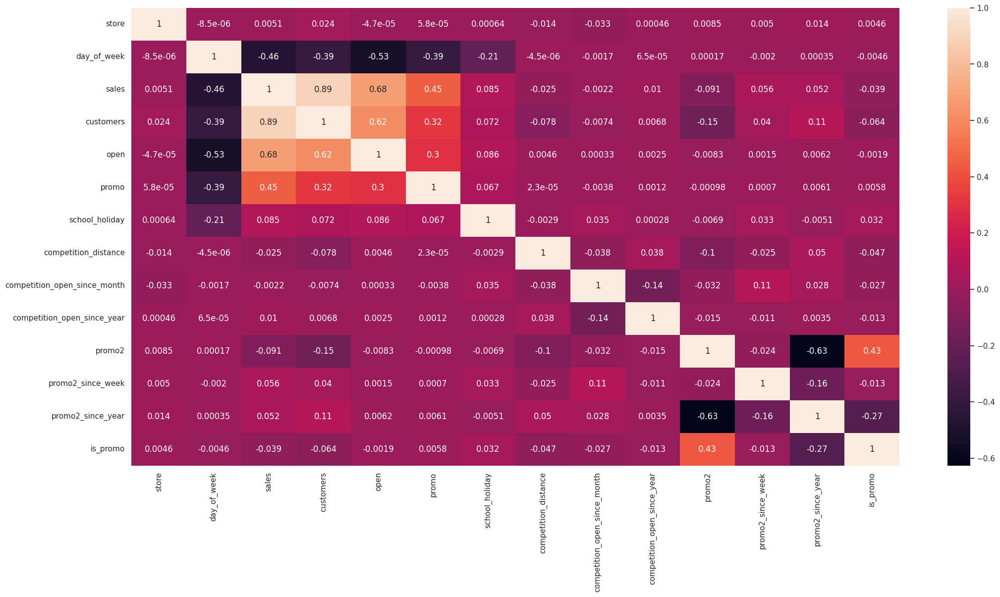

<h6 align="center"><a href="/README.md">PORTUGUÊS</a> | <a href="/README_en.md">ENGLISH</a>
</h6>
 

<h1 align="center">
    
</h1>

<h4>

Sales forecast model for Rossmann stores.

</h4>
 

## Business Problem
Rossmann operates more than 3,000 drugstores in 7 European countries. Currently, Rossmann store managers are tasked with forecasting their daily sales up to six weeks in advance. Store sales are influenced by many factors, including promotions, competition, school and state holidays, seasonality and location. With thousands of individual managers forecasting sales based on their unique circumstances, the accuracy of the results can be quite varied.

Rossmann is challenging you to forecast 6 weeks of daily sales for 1,115 stores located across Germany. Reliable sales forecasts allow store managers to create effective employee schedules that increase productivity and motivation. By helping Rossmann create a robust forecasting model, you'll help store managers stay focused on what matters most to them: their customers and their teams!

## Data
The data used to in this problem was obtained from Kaggle, in the ["Rossmann Store Sales" challenge](https://www.kaggle.com/c/rossmann-store-sales). The data includes information about sales, promotions, holidays, weather conditions and other factors that can influence sales.

## Solution
The proposed solution consists of a machine learning model that can predict sales at Rossmann stores over the next six weeks. This model is hosted in the cloud, and can be accessed through a Telegram bot at any time, so project stakeholders have the sales forecast for their stores always available.

## Exploratory Data Analysis
The first step to solve the proposed problem was to carry out a data description and an exploratory data analysis, aiming to treat and understand the available data.

Three types of analyzes were conducted:

### **Univariate Analysis**
Analysis of the distribution of each variable in isolation. At this stage it was possible to observe, for example, that **the response variable has a somewhat normal distribution**.

## **Bivariate Analysis**
Each variable is analyzed in relation to the *target variable*. In this phase, a list of hypotheses that can provide *insights* about the data is created and then validated. Some important findings were:

- There is **no clear correlation** between competition distance and sales.
- There is **no clear correlation** between competitors age and sales.
- There is **no clear growth trend** in sales through the years, But there is a seasonality trend.

### **Multivariate Analysis**
Here, the **Pearson Coefficient** was used to analyze the relationship between numerical variables;

And *Cramér's V* was used to analyze categorical variables.

## Machine Learning Model
To choose the ideal model, several models are tested without modifying parameters and comparing their metrics with a simple average model. The result was:

| **Model**             | **MAE** | **MAPE** | **RMSE** |
|-----------------------|:---------:|:----------:|:----------:|
| **Random Forest**     | 651.34  | 0.0958   | 1023.1   |
| **XGBoost**           | 1130.0  | 0.1671   | 1632.44  |
| **Average Model**     | 1354.8  | 0.2064   | 1835.14  |
| **Lasso**             | 1890.57 | 0.2893   | 2741.42  |
| **Linear Regression** | 2078.71 | 0.3047   | 3102.64  |

> [!NOTE]
> This data shows that **linear models do not perform better than the average model**, which indicates that **this data requires more complex models**.

Next the models' performance are analyzed using *cross validation*, and the results are:

| **Model**             | **MAE CV**         | **MAPE CV**       | **RMSE CV**        |
|-----------------------|:--------------------:|:-------------------:|:--------------------:|
| **Random Forest**     | 733.8 +/- 117.35   | 0.106 +/- 0.0158  | 1102.23 +/- 178.97 |
| **XGBoost**           | 981.66 +/- 103.56  | 0.1409 +/- 0.0108 | 1401.81 +/- 145.51 |
| **Lasso**             | 1947.16 +/- 132.37 | 0.2863 +/- 0.0033 | 2814.28 +/- 214.06 |
| **Linear Regression** | 1927.38 +/- 95.66  | 0.298 +/- 0.0153  | 2724.56 +/- 179.52 |

## Final Model
After testing, the model chosen to implement the final solution was **XGBoost Regressor**

> [!NOTE]
> The **XGBoost Regressor** model was preferred, among others with better performance, for its **fast implementation and smaller file size**. These characteristics are important when you want to deploy the model into production.

To perform hyperparameter tuning, the **Random Search** algorithm was used, which produced a model with the following performance:

| **Model**             | **MAE** | **MAPE** | **RMSE** |
|-----------------------|:-------:|:--------:|:--------:|
| **XGBoost Regressor** | 729.5   | 0.1066   | 1088.71  |

## Performance
It is possible to analyze the performance of the final model in a few different ways.
- It is possible to observe that most stores have a **percentage error (MAPE) in the range of 0% to 20%**, however the **maximum error is close to 120%**, which can represent a problem.

|**Scenario**    | **Values**       |
|:--------------:|:----------------:|
| Predictions    | € 282,895,872.00 |
| Worst Scenario | € 249,995,088.00 |
| Best Scenario  | € 315,796,640.00 |

- It is possible to add the expected revenue for all stores, and project total revenue scenarios based on the average error.

- The upper right graph shows that the **model is underestimating** the values, if the overestimation is better for the business model, the model must be adjusted.

## Deploy
The final model was made available through an API developed with [FastAPI](https://fastapi.tiangolo.com/) and hosted on [Render](https://render.com/). The code for this API is [available here](https://github.com/eliasbatistasouza/rossmann_api).

Prediction results can also be accessed through a Telegram bot.

 

You can see a bot demonstration below. The bot code is [available here](https://github.com/eliasbatistasouza/rossmann_bot).

https://github.com/eliasbatistasouza/rossmann_sales/assets/8121717/274dff03-ca4b-4332-b2ea-4d4c244e1e51

## Conclusion
After the first development cycle, there is a functional product that meets the necessary requirements of the proposed business problem.

The possibility of viewing the revenues of all stores at any time on a mobile device gives greater agility and assertiveness to the company decision-making.

## Next steps
- Test the model with other features
- Use other fine tuning methods such as Grid Search or Bayesian Search
- Test other machine learning algorithms

## License
Distributed under the MIT License. See `LICENSE.txt` for more information.

## Author
Made with ❤️ by Elias Batista 👋🏽 Get in touch!

 
